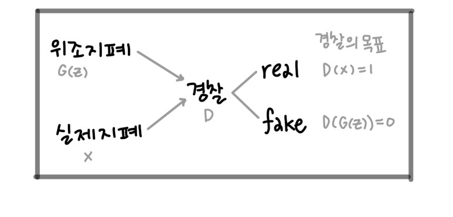

GAN을 처음 접할 때 아래와 같은 그림을 이용해서 이해하면 편하다.
```

```
0과 1로 구성된 노이즈가 있다.

해당 노이즈를 갖고 위조지폐범이 위조지폐를 만든다.

경찰은 위조지폐와 실제 지폐를 구분한다. (위조지폐: 0, 실제 지폐: 1 출력)

이렇게 한번 경찰이 지폐를 구분하는 것이 하나의 epoch이 된다.


첫번째 epoch에서는 경찰이 위조지폐와 진짜 지폐를 잘 구분할지 몰라도 점차 위조지폐범은 더욱 비슷하게 생긴 위조지폐를 만들 것이고 경찰도 더 잘 구분하기 위해 노력할 것이다.

어느 순간 완벽한 위조지폐가 만들어지면 경찰은 해당 지폐를 잘 구분할 수 없어서 찍기 시작할 것이다.

확률은 진짜 혹은 가짜 중 하나이므로 50%가 되고 학습이 끝나게 된다.


위의 개념에서 아래와 같은 문자로 이해하면 된다.

노이즈: z

위조지폐범: Generator

경찰: Discriminator (위조지폐는 D(G(z))=0, 실제지폐는 D(G(z))=1 출력)


Discriminator 모델은 어떤 input 데이터가 들어갔을 때 해당 input 값이 어떤 것인지 classify하므로 지도학습이고 Generator 모델은 어떤 잠재적인 코드를 가지고 해당 데이터를 학습 데이터가 되도록 학습하는 과정이므로 비지도 학습이다.

------

이제 Discriminator와 Generator 입장에서 각각 GAN을 설명하도록 한다.

D의 입장



Discriminator 모델이 진짜 이미지와 가짜 이미지를 가지고 진짜 가짜 여부를 구분하도록 학습한다.

따라서 들어가는 input은 G(z)와 x의 차원은 이미지의 경오와 같은 고차원 벡터가 들어갈지 몰라도 결국 나오는 output은 0과 1의 값을 가지게 된다.

(sigmoid 함수를 사용)


G의 입장


Generator 입장에서는 Discriminator가 진짜 이미지를 잘 맞추는지는 관심이 없다.

단지 본인이 만든 이미지가 얼마나 Discriminator를 잘 속일 수 있는지가 중요하다.(D(G(z))=1이 되도록 함)

------

**목적함수(Objective function, Loss function)**


G는 V(D, G)가 최소가 되려고 하고 D는 V(D, G)가 최대가 되려고 한다.

------

D의 입장


D는 경찰이다. 가짜 데이터에 0, 진짜 데이터에 1을 출력해야 한다.

x는 진짜 데이터이고 G(z)는 G가 z를 가지고 만든 가짜 데이터이다.

따라서 D(z)=1이 되어야 하며, D(G(z))=1이 되도록 하는 것이 목표이다.


G의 입장


G는 위조지폐범이다. 경찰과 반대로 G는 D가 가짜 데이터에 대해 1을 출력하게 해야 한다.

D가 진짜 데이터를 제대로 구별하는지는 관심이 없다.

x는 진짜 데이터이고 G(z)는 G가 z를 가지고 만든 가짜 데이터이다.

따라서 D(x)=0이 되어야 하며, D(G(z))=1이 되도록 해야 한다.
